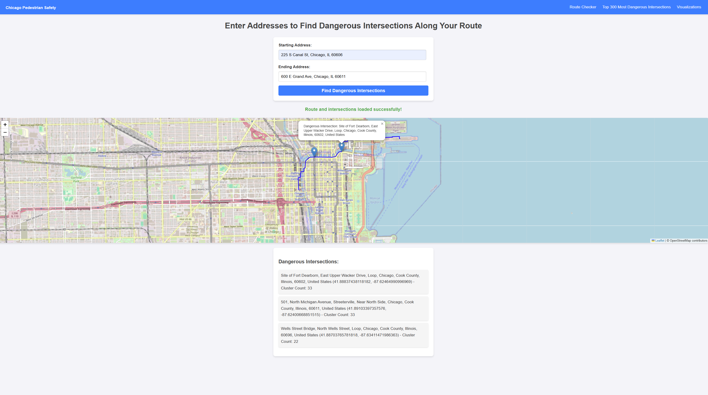

# ChicagoPedestrianSafety
---


This project aims to analyze pedestrian-involved traffic crashes in Chicago, with a focus on identifying high-risk streets and intersections. The main hypothesis is that pedestrian accidents are more frequent in areas with high foot traffic, poor lighting, adverse weather conditions, and during rush hours. Through analysis of datasets from the City of Chicago's Traffic Crashes - People and Traffic Crashes - Crashes, the project identifies significant intersections prone to pedestrian accidents, particularly around major transit hubs. The results show that peak crash times occur during rush hours (16:00–18:00), and factors like poor lighting and weather conditions, such as rain, contribute to heightened risks. Demographic factors have a lesser impact, highlighting that Chicago’s diverse population faces similar risks. The project integrates clustering and correlation analysis to offer actionable insights for policymakers and urban planners.

Additionally, a chatbot powered by GPT-4.0 was developed using Chatbase.co. This chatbot offers information on high-risk intersections, the influence of weather and time of day on crash frequencies, and personalized safety tips for pedestrians. It can also analyze routes for dangerous areas, helping users make informed decisions about their commute. The chatbot serves as a tool for both public awareness and targeted infrastructure improvements, supporting a safer and more pedestrian-friendly city.

## Features
- **Geocoding**: Convert addresses to geographical coordinates (latitude and longitude).
- **Route Generation**: Generate walking routes between two addresses using OpenRouteService.
- **Dangerous Intersection Detection**: Identify dangerous intersections along the route using predefined intersection data.
- **Map Visualization**: Display the route, dangerous intersections, and pedestrian-involved traffic crash clusters on an interactive map using Leaflet.js.
- **Chatbot**: provides users with data-driven insights into pedestrian safety

## Requirements

- Python 3.x
- Flask
- OpenRouteService API Key (https://openrouteservice.org/)
- Geocoding API Key (https://geocode.maps.co/)
- JavaScript, Leaflet.js for map rendering

## Installation

1. **Clone the Repository**
   ```bash
   git clone https://github.com/your-username/ChicagoPedestrianSafety.git
   ```

2. **Install Required Packages**
   Ensure you have Python 3.x installed and then install the required dependencies:
   ```bash
   pip install -r requirements.txt
   ```

3. **Set Up API Keys**
   - Create a `.env` file or modify `config.py` to include your API keys for OpenRouteService (`ORSapi_key`) and the Geocoding API (`GEOCODEapikey`).

4. **Run the Application**
   Start the Flask application:
   ```bash
   python app.py
   ```
   The application will be available at `http://127.0.0.1:5000/`.

## Usage
1. **Enter Start and End Addresses**
   - Go to the homepage of the application.
   - Input the starting address and ending address in the form fields.
   
2. **Submit the Form**
   - After entering the addresses, click the "Submit" button.
   - The page will reload with a map showing the route and dangerous intersections along the way.

3. **View the Results**
   - The route will be plotted on the map, and dangerous intersections will be marked with pins.
   - Each intersection will display an informational popup when clicked.
     
## Endpoints

### 1. `/` - Home Page

Displays the main page with a Leaflet map and interactive features, including the option to input a start and end address as well as the embeded chatbot powered by Chatbase.co.

### 2. `/check` - Route Query Page

Allows users to input start and end addresses to generate a route and see intersections that are dangerous.

### 3. `/get_coordinates` - Geocode Address to Coordinates

**GET** request that converts a user-input address into latitude and longitude.

**Example:**
```bash
GET /get_coordinates?address=225+S+Canal+St,+Chicago,+IL
```

Returns:
```json
{
  "latitude": 41.8760,
  "longitude": -87.6360
}
```

### 4. `/get_intersections` - Get Dangerous Intersections

**POST** request that takes the start and end addresses, generates the route, and returns a list of dangerous intersections along the route.

**Example:**
```json
{
  "start_address": "225 S Canal St, Chicago, IL",
  "end_address": "800 W Fulton Market, Chicago, IL"
}
```

Returns:
```json
{
  "route": [[lat1, lon1], [lat2, lon2], ...],
  "intersections": [
    {
      "Latitude": 41.8780,
      "Longitude": -87.6360,
      "Address": "Intersection 1 Address"
    },
    {
      "Latitude": 41.8790,
      "Longitude": -87.6370,
      "Address": "Intersection 2 Address"
    }
  ]
}
```
### 5. `/visualizations` - Visualizations Gallery Page

Allows users to view visualizations graphs of the data.

## Datasets
https://data.cityofchicago.org/Transportation/Traffic-Crashes-Crashes/85ca-t3if/about_data 
https://data.cityofchicago.org/Transportation/Traffic-Crashes-People/u6pd-qa9d 
---


